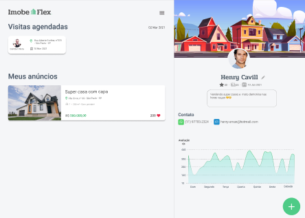

# Projeto Imobe

## Entendendo o negócio
Para entendermos o negócio precisamos compreender o funcionamento de uma imobiliária de pequeno porte. Ela pode ser caracterizada como um escritório, uma imobiliária virtual ou até um ponto fixo na rua.

Mas, com até 4 ou 5 corretores de imóveis.
Nesse formato então, não requer muita sofisticação. Por isso, a estrutura organizacional da imobiliária de pequeno porte é menor.

* Como a imobiliária ganhará dinheiro: Com a venda e aluguel de imóveis.
* Como a imobiliária gerará receita: Cobrando pela prestação de serviço, expansão de marketing para novas negociações na área aplicada, e assim atraindo novos clientes
* Qual o modelo de receita: Modelo de Receita por Mensalidade cobrada dos Vendedores

## Banchmarking

Com o aquecimento do ramo imobiliário, tem sido uma grande fonte de investimentos e crescimento de vendas tem aumentado em grande porte, onde taxas de juros de financiamento têm sido reduzidas, o lançamento e a venda  de imóveis  cresceram exponencialmente em 2019.

Segundo os Indicadores Imobiliários Nacionais, divulgados pela Câmara Brasileira da Indústria da Construção (CBIC), o lançamento de imóveis cresceu 23,9%. Já as vendas tiveram um aumento de 15,4% em relação ao mesmo período do ano anterior.

